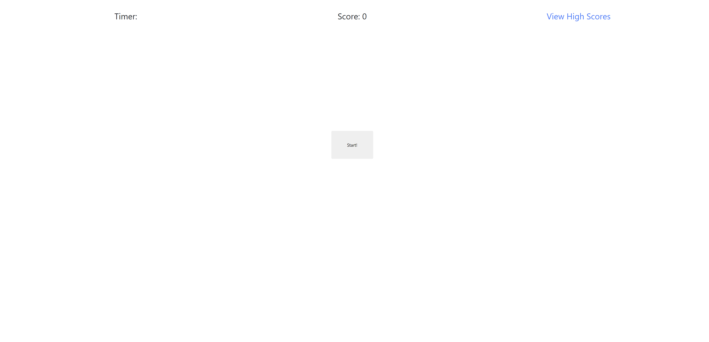
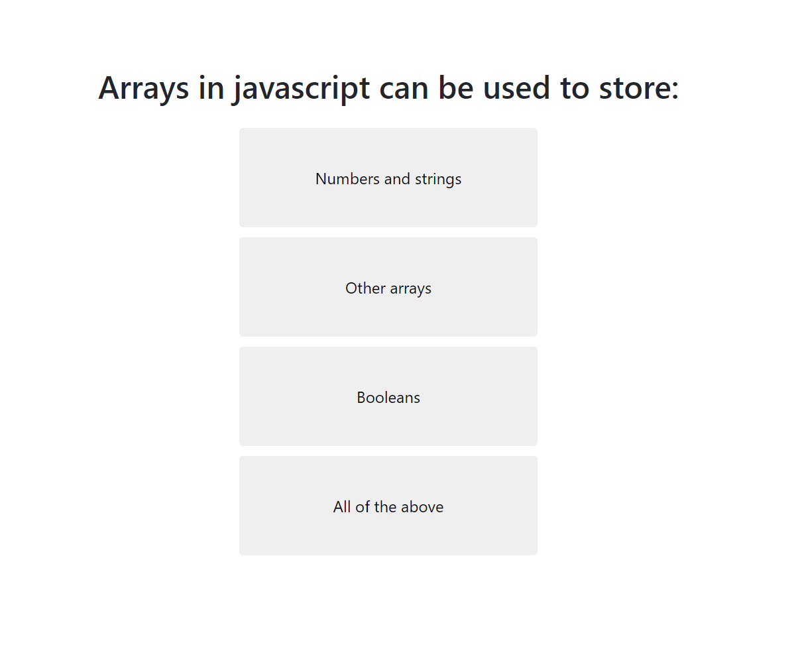
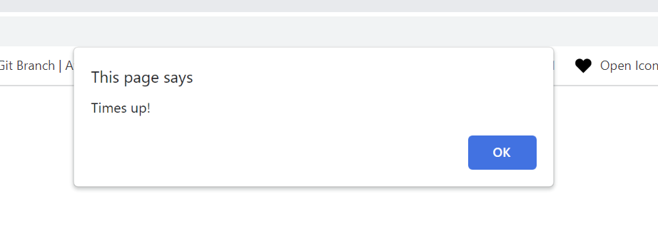
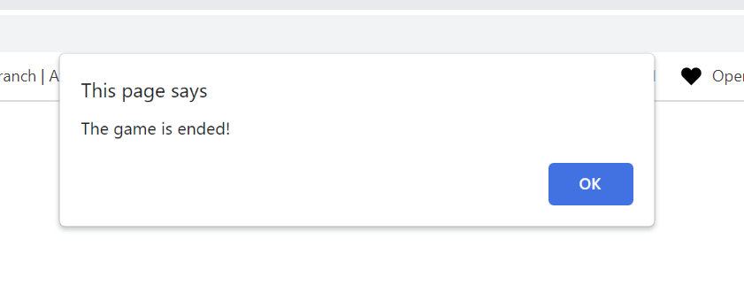
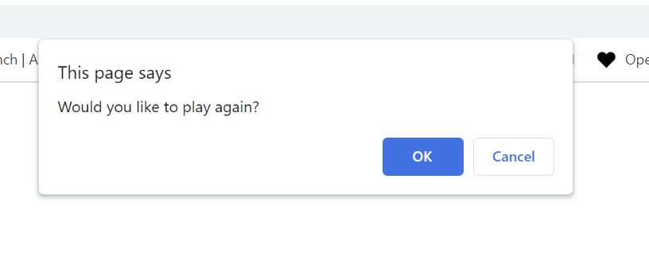
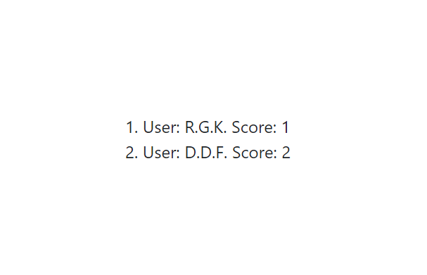

# Coding Quiz

This repository contains the HTML, CSS and Javascript source code for my Coding Quiz Project.

## Table of Contents

[Description](#description)  
[Installation](#installation)  
[How It Works](#howitworks)  
[Utilizes](#utilizes)  
[Deployed Application](#deployedApplication)  
[License](#license)

## Description

Coding quiz was developed so that users can users can quickly and easily test their knowledge of various programming topics. This application is front-end only and was undertaken to increase my familiarity with using local storage to store data.

In the near future, I plan to rebuild the application from the ground up using the React framework, which I believe would be better suited for conditionally rendering the quiz questions. I may also store quiz questions and user score data in a MySQL or MongoDB database.

## Installation

Download the source code and run the index.html file (located in the root directory of the project folder) in a browser.

## How it works

Selecting the start button initiates a new quiz session and starts the countdown timer. Questions are then rendered using a while loop that terminates upon reaching the final index of the questions array. Indexes are incremented using an event listener attached to the answer button located below each question.

Each question provides four choices, as is shown below:

Correct answers increment the local "score" variable by 10, while incorrect answers decrement the "countdown" timer by 10 seconds.

The game ends when all questions have been answered or if time runs out prior to completion of the quiz. Failing to complete the quiz within the allotted timeframe will cause the following prompt to appear;

Completing the quiz will cause the following prompt to display;

In either case, the game will end, and the user will be asked to provide his or her initials. The user can then choose whether or not ot play again.

If the player chooses to initiate another quiz session, the application will loop throught the questions once more. Should the player choose not to play again, the application will rerender the start button.

Scores are saved to the browser's local storage, which can be viewed by hitting the "View High Scores" link in the top right portion of the page. Doing so will display the following menu;

## Utilizes

- HTML
- CSS
- JavaScript

## Deployed Application

The deployed application can be found using the link below.

https://rrich-kray.github.io/coding-quiz/

## License

Copyright (c) 2022, Ryan Kray
All rights reserved.

This source code is licensed under the BSD-style license found in the LICENSE file in the root directory of this source tree and reproduced below.

Redistribution and use in source and binary forms, with or without modification, are permitted provided that the following conditions are met:

1. Redistributions of source code must retain the above copyright notice, this list of conditions and the following disclaimer.
2. Redistributions in binary form must reproduce the above copyright notice, this list of conditions and the following disclaimer in the documentation and/or other materials provided with the distribution.
3. All advertising materials mentioning features or use of this software must display the following acknowledgement: This product includes software developed by Ryan Kray.
4. Neither the name of this application's developer nor the names of its contributors may be used to endorse or promote products derived from this software without specific prior written permission.

THIS SOFTWARE IS PROVIDED BY THE COPYRIGHT HOLDER ''AS IS'' AND ANY EXPRESS OR IMPLIED WARRANTIES, INCLUDING, BUT NOT LIMITED TO, THE IMPLIED WARRANTIES OF MERCHANTABILITY AND FITNESS FOR A PARTICULAR PURPOSE ARE DISCLAIMED. IN NO EVENT SHALL THE COPYRIGHT HOLDER OR CONTRIBUTORS BE LIABLE FOR ANY DIRECT, INDIRECT, INCIDENTAL, SPECIAL, EXEMPLARY, OR CONSEQUENTIAL DAMAGES (INCLUDING, BUT NOT LIMITED TO, PROCUREMENT OF SUBSTITUTE GOODS OR SERVICES; LOSS OF USE, DATA, OR PROFITS; OR BUSINESS INTERRUPTION) HOWEVER CAUSED AND ON ANY THEORY OF LIABILITY, WHETHER IN CONTRACT, STRICT LIABILITY, OR TORT (INCLUDING NEGLIGENCE OR OTHERWISE) ARISING IN ANY WAY OUT OF THE USE OF THIS SOFTWARE, EVEN IF ADVISED OF THE POSSIBILITY OF SUCH DAMAGE.
